## 🚀 OpenROAD Flow: From RTL to Placement

This guide provides a detailed walkthrough of setting up the OpenROAD-flow-scripts environment, running a digital design from RTL to the placement stage, and visualizing the results. It also documents common installation errors and their solutions, offering a complete record of the VLSI physical design process for the `gcd` (Greatest Common Divisor) example design.

-----

## Why This Flow is Important: The VLSI Design Journey

In VLSI (Very Large Scale Integration), we turn abstract ideas for a chip, written in a hardware description language (like Verilog), into a physical blueprint that can be manufactured on silicon. This process is called the RTL-to-GDSII flow. The steps we're performing are a critical part of the **backend** or **physical design** stage.

Here's a simplified view of the process and where our task fits in:

```mermaid
graph TD
    subgraph "Phase 1: Inputs"
        A[Gate-Level Netlist <br/> from Yosys synthesis];
        B[Sky130 Physical Libraries <br/> .lef & .lib files];
    end

    subgraph "Phase 2: Physical Design "
        A --> C{OpenROAD Tool};
        B --> C;
        C --> D(1. Floorplanning);
        D --> E(2. Placement);
        E --> F[Placed Design Layout <br/> .def & .odb files];
    end

    subgraph "Phase 3: Visual Analysis"
        F --> G{Visualization};
        B --> G;
        G --> H["OpenROAD GUI <br/> (Primary Tool)"];
        G --> I["KLayout <br/> (Alternative Viewer)"];
        H --> J[✅ Visual Verification];
        I --> J;
    end
```



  * **Synthesis:** Converts your Verilog code into a network of standard logic gates (like AND, OR, NOT) and flip-flops.
  * **Floorplanning (You did this\!):** Defines the chip's physical dimensions, allocates space for different blocks, and plans the power grid. It's like creating the blueprint of a house.
  * **Placement (You did this\!):** Takes the thousands of standard cells from the netlist and places them in rows within the floorplan, aiming for the best possible performance.

By completing these steps, you are taking the first crucial leap from pure logic to a physical reality, directly impacting the chip's final speed, size, and power consumption.

-----

## ⚙️ Step 1: Installation and Setup

### 1.1: Clone the Repository

First, we clone the OpenROAD Flow Scripts and all its necessary sub-modules.

```bash
git clone --recursive https://github.com/The-OpenROAD-Project/OpenROAD-flow-scripts.git
cd OpenROAD-flow-scripts
```

### 1.2: Install All Dependencies

The provided scripts can install most dependencies, but we discovered a more robust method is to use the `-all` flag. This command installs system-level packages and builds required local libraries.

```bash
sudo ./etc/DependencyInstaller.sh -all
```

**Note:** This step can take a very long time (sometimes over an hour), especially when building large libraries like Boost and Eigen. It may appear "stuck," but it is working in the background.

### 1.3: Build the OpenROAD Tools

With all dependencies in place, we compile and build the core OpenROAD executable.

```bash
./build_openroad.sh --local
```

A successful build is the final step of the installation process\!

> 

-----

## 🛠️ Step 2: Troubleshooting Common Build Errors

During installation, several dependencies were missing. Here are the errors encountered and their solutions, which were ultimately resolved by the `DependencyInstaller.sh -all` command.

  * **Error 1: Missing `GTest`**

      * **Symptom:** Build fails with `Could NOT find GTest`.
      * **Solution:** Install the Google Test development library.
        ```bash
        sudo apt-get install libgtest-dev
        ```

  * **Error 2: Missing `spdlog`**

      * **Symptom:** Build fails with `Could not find a package configuration file provided by "spdlog"`.
      * **Solution:** Install the spdlog development library.
        ```bash
        sudo apt-get install libspdlog-dev
        ```

  * **Error 3: Other Missing Libraries (`yaml-cpp`, `or-tools`, etc.)**

      * **Symptom:** The build would fail sequentially on different packages.
      * **Definitive Solution:** Re-running the dependency installer with the `-all` flag fixed all remaining issues by ensuring the entire environment was correctly set up.
       ```bash
        sudo apt update
        sudo apt install -y build-essential cmake python3 python3-venv python3-pip \
        tclsh libreadline-dev bison flex libffi-dev git \
        libboost-all-dev clang libeigen3-dev swig \
        libx11-dev libxaw7-dev libxrandr-dev libxcb1-dev \
        libxinerama-dev libxcursor-dev libxft-dev
        ```
-----

## 🏃‍♂️ Step 3: Running the Flow (Up to Placement)

For the Week 5 task, we needed to run the flow only up to the placement stage. We use the `make` command, specifying the design configuration and the final target stage, which is `place`.

```bash
# Navigate to the flow directory
cd flow

# Run the flow
make DESIGN_CONFIG=./designs/sky130hd/gcd/config.mk place
```

This command automatically executes synthesis, floorplanning, and then placement, stopping before Clock Tree Synthesis.
> 
> 
-----

## 🖼️ Step 4: Visualizing the Layout

With the flow successfully run, the final step is to visualize the physical layout. Both the native OpenROAD GUI and the alternative KLayout viewer are excellent tools for this.

**Important Prerequisite:** Before running any visualization commands in a new terminal, you must set up the environment.

```bash
# Navigate to the main project directory
cd ~/OpenROAD-flow-scripts

# Source the environment script (do this in every new terminal)
source ./env.sh
```

-----

### 4.1: Method 1: Using the OpenROAD GUI (Primary)

The most reliable way to use the OpenROAD GUI is to launch it empty and then open the design files from the file menu.

**1. Launch the GUI**

```bash
# Navigate to the flow directory
cd ~/OpenROAD-flow-scripts/flow

# Launch the empty GUI
openroad -gui
```

**2. View the Floorplan**

  * In the OpenROAD window, go to the menu and click **File -\> Open...**
  * Navigate to and select the floorplan database file:
    `results/sky130hd/gcd/base/2_floorplan.odb`

>  **Set Path**
> 
>  

> **Select Desired File**
> 
> 

>  **OUTPUT**
> 
>  

**3. View the Placement**

  * In the menu, click **File -\> Close** to close the current view.
  * Go to **File -\> Open...** again and select the placement database:
    `results/sky130hd/gcd/base/3_place.odb`

>  **Select Desired File**
> 
>  

>  **OUTPUT**
> 
>  

-----

## 4.2: Method 2: Using KLayout (Alternative)

KLayout is a powerful, lightweight viewer that reads `.def` files. To use it, we first need to convert our `.odb` results to the `.def` format.


### Step 1: Navigate to your flow directory

```bash
cd ~/OpenROAD-flow-scripts/flow
```

***

### Step 2: Start OpenROAD shell

```bash
openroad
```

***

### Step 3: Load Technology and Merged LEF files

```tcl
read_lef platforms/sky130hd/lef/sky130_fd_sc_hd.tlef
read_lef platforms/sky130hd/lef/sky130_fd_sc_hd_merged.lef
```

***

### Step 4: Load Floorplan ODB & Export DEF

```tcl
read_db results/sky130hd/gcd/base/2_floorplan.odb
write_def results/sky130hd/gcd/base/2_floorplan.def
```

### Step 5: Load Placement ODB & Export DEF

(Note: If you get error "db is already populated", start a fresh OpenROAD session)

```tcl
read_db results/sky130hd/gcd/base/3_place.odb
write_def results/sky130hd/gcd/base/3_place.def
```
> 
***

### Step 6: Exit OpenROAD shell

```tcl
exit
```

### Step 7: Verify files are generated

```bash
ls -lh results/sky130hd/gcd/base/2_floorplan.def results/sky130hd/gcd/base/3_place.def
```

## Step 8: Open DEF files in KLayout with Both LEF files

```bash
klayout -l platforms/sky130hd/lef/sky130_fd_sc_hd.tlef -l platforms/sky130hd/lef/sky130_fd_sc_hd_merged.lef results/sky130hd/gcd/base/2_floorplan.def
```

and for placement DEF:

```bash
klayout -l platforms/sky130hd/lef/sky130_fd_sc_hd.tlef -l platforms/sky130hd/lef/sky130_fd_sc_hd_merged.lef results/sky130hd/gcd/base/3_place.def
```

***

## Additional Notes

- If you see warnings about missing macros, it means some cells referenced in DEF are missing from the merged LEF.
- To fix this, you need a full LEF file containing all cell macros with geometry.
- Your DEF files must be correctly generated without corruption (check file size and format).
- Always load both `.tlef` and merged `.lef` files in KLayout to properly display layers and macros.

***

## Outputs


***


## ✅ Conclusion

This journey successfully navigated the complexities of setting up a modern VLSI toolchain, troubleshooting system-level dependencies, and executing a physical design flow. The required floorplan and placement layouts were successfully generated from a Verilog RTL source and visualized using both the primary OpenROAD GUI and the KLayout alternative, demonstrating a comprehensive understanding of the flow.
